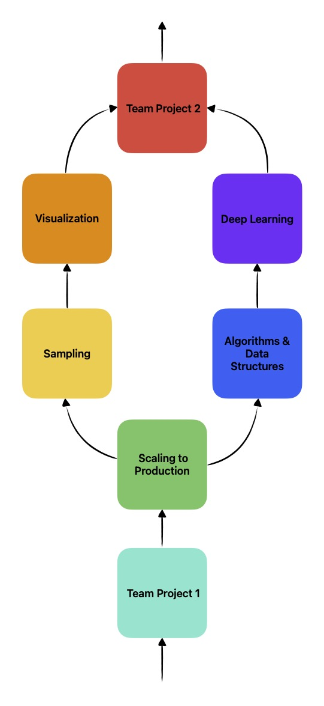

# Introduction to Data Science Portfolios

```
$ echo "Data Sciences Institute"
```


<!-- Why a data science portfolio is crucial for your career. Overview of portfolio components. -->

<!-- Speaker notes: A portfolio is essential for showcasing your real-world skills and experiences, making you stand out to potential employers. It provides concrete examples of your ability to solve problems and generate insights from data, which is crucial in the competitive field of data science. By effectively presenting your projects, you demonstrate not just technical proficiency but also your capability to communicate complex ideas clearly. -->

---

# Hello everyone!

We hope you've all been doing well and have learned a lot of new and great things since Team Project 1. After working in your separate streams, we're excited to have everyone back together as one module. This module is a continuation of our journey together, aimed at addressing some of the common challenges and areas for improvement we observed in your projects.

<!-- There is no specific structure to these slides; instead, they present a collection of important points based on the feedback and common issues identified. Let's dive in and enhance your skills to make your projects even more impactful and impressive! -->




---

# Addressing some questions

---

# How is this Module Different from Team Project 1?

The goal of the two-team project modules is to help you create a strong data science project for your portfolio. This way, employers, recruiters, HR personnel, and your network can see your skills and say, "This person is really good at what they do! 🧐"

- In **Team Project 1**, we grouped you into teams based on project interests, using foundational skills from the modules you learned: Shell, Git, Python, SQL, and Applying Statistical Concepts.

- **Team Project 2** focuses on leveraging everything you’ve learned in your streams and Scaling to Production to elevate your projects. Some teams' new skills will align with their original goals, while others may choose to revise their approach. Both outcomes are valuable lessons **for your GitHub presence**.

---

# Why are my Team Members Different?

We’ve reorganized the teams to consider those who have left or changed their streams. Despite these changes, it's essential to push forward and work together to create a good portfolio. In the industry, people often leave and join projects, so treat new members as new coworkers. If you have new members, reach out and introduce yourselves. Regroup, set expectations, establish rules of engagement, and create your own timelines and deadlines.

---

# When is this due?


Team project 2 has the following requirements:
- Each team member must create, review, and merge a pull request.
- Each team member must contribute to the repository’s log.
- Each team member must create a video about their learnings and experience.
- Each project's README should describe the project, why the team approached the project the way they did, and should demonstrate thoughtful consideration of the [guiding questions on GitHub](https://github.com/UofT-DSI/team_project/blob/main/team_project_2.md#data-visualization-guiding-questions). 

You  must meet these requirements by *August 15th*. The project itself doesn't need to be finished by this deadline as **🚨you are encouraged to continue improving it.🚨**

---

# Let's jump right in

---

# What is a Good Portfolio?

A good portfolio showcases your best work and highlights skills that are highly valued by employers in data science and machine learning. It demonstrates your ability to handle real-world tasks, making you an attractive candidate for employment.

**Personalize Your Portfolio:**
- **Remove generic content:** For instance, delete the default README we provided. It's designed to describe the module, not your unique project.
- **Highlight your unique contributions and skills:** This personalization shows employers that you're not just completing assignments but are engaged and innovating on your projects.

---


# Types of Projects to Include in Your Portfolio

Including a diverse range of projects in your portfolio can significantly enhance your appeal to potential employers. Consider including a variety of project types to demonstrate the breadth and depth of your data science skills:

1. **Data Cleaning Project:** Show your ability to prepare data for analysis.
2. **Data Storytelling and Visualization Project:** Highlight your skills in interpreting and presenting data in compelling ways.
3. **ML Modeling:** Demonstrate your proficiency in building and tuning models.
4. **Group Project:** Showcase your teamwork and collaboration skills. (already doing this! 🥳)

For more, read "[How to Create a Project Portfolio for Data Science Job Applications](https://www.dataquest.io/blog/career-guide-data-science-projects-portfolio/)"


---

# Selecting Projects That Showcase Your Skills

Choosing the right projects for your portfolio is crucial. Each project should:

- **Solve Real Problems**: Use actual datasets to address genuine issues in your field. (*examples in the next slide*)
- **Demonstrate Industry Relevance**: Select projects that are pertinent to your specific area, such as marketing analytics for marketers or predictive maintenance for engineers.
- **Provide Actionable Insights**: Focus on projects that deliver clear, practical outcomes that demonstrate your ability to impact real-world scenarios.

These criteria ensure that your projects not only highlight your technical skills but also your understanding of and adaptability to industry-specific challenges, making you a valuable candidate to potential employers.

---

# Some Open Source Real Datasets

- **University of Toronto Libraries Data**: [onesearch.library.utoronto.ca/researchdata](https://onesearch.library.utoronto.ca/researchdata/accessing-data-and-tools)
- **Open Government Data Portal (Canada)**: [open.canada.ca/data](https://open.canada.ca/data)
- **Ontario Data Catalogue**: [data.ontario.ca](https://data.ontario.ca)
- **Kaggle Datasets**: [kaggle.com/datasets](https://www.kaggle.com/datasets)
- **UCI Machine Learning Repository**: [archive.ics.uci.edu/ml](https://archive.ics.uci.edu/ml/index.php)
- **World Bank Open Data**: [data.worldbank.org](https://data.worldbankzorg)

Utilize these resources to find relevant datasets that can help you build projects showcasing your ability to solve real-world problems, demonstrate industry relevance, and provide actionable insights.

---

Let me know if this works for you or if you need any further adjustments!

# Showcase Projects That Use Diverse Data Types

Enhance your projects by effectively using a mix of structured, unstructured, and time series data:

- **Structured Data**: Employ database data for clear, quantifiable insights.
- **Unstructured Data**: Add depth with text, images, or videos.
- **Time Series Data**: Utilize data in sequential order for trend analysis and forecasting.

Select data types strategically to align with your project's objectives. Ensure each type contributes to a clear and coherent narrative, avoiding unnecessary complexity to maintain focus and utility.

---

# Demonstrating Technical and Business Skills

- **Demonstrate Coding Proficiency**: All projects should showcase your ability to write clean, efficient, and well-documented code.
- **Showcase Communication Skills**: All projects should effectively communicated complex data-driven insights to Non-technical team members.

Your ability to document code clearly and communicate effectively can drastically reduce onboarding times for new team members and help non-technical stakeholders make informed decisions, thereby enhancing overall project success and team efficiency.

---


# Crafting a Comprehensive Main README File

- **Purpose & Overview:** Introduce the project with essential details, concise description and a project objective.
- **Goals & Objectives:** Articulate what the project aims to achieve.
- **Techniques & Technologies:** Highlight the tools and methods used.
- **Key Findings & Instructions:** Summarize outcomes and provide setup instructions.
- **Visuals & Credits:** Enhance with visuals; acknowledge contributors.

<!-- 
Focus on the essence of what makes a README effective: clarity and conciseness. A well-organized README provides a snapshot of the project, helping others quickly understand its value and how to engage with it. Ensure that each element is presented in a way that contributes to an overall understanding of the project.
-->

---


# Better Documentation - README

While **you can have multiple README files** in your repository, include only one README file per folder to keep things clean and simple. This structure showcases your ability to manage and present complex information effectively, increasing your appeal to potential employers.


---

# Better Documentation - Comments

**Effective commenting enhances code readability and maintainability, crucial for collaborative environments.**

A lot of participants had code that wasn't properly commented. The idea here is that if someone with no tech background reads your code, they should get the essence of what you're doing and how the code flows. This practice not only aids in understanding but also facilitates smoother transitions and updates within team projects.

📰 [Best practices for writing code comments](https://stackoverflow.blog/2021/12/23/best-practices-for-writing-code-comments/)

---
## Example

❌
```
function calculateTotal(price, quantity) {
    return price * quantity;
}

let totalPrice = calculateTotal(25, 5);
console.log(totalPrice); // Output: 125
```

✅
```
// Calculates the total cost by multiplying the price per item with the quantity
function calculateTotal(price, quantity) {
    return price * quantity;
}

// Example usage: Calculates the total price for 5 items at $25 each by multiplying the price
// per item ($25) with the quantity (5), and stores the result in the totalPrice variable.
let totalPrice = calculateTotal(25, 5);
console.log(totalPrice); // Output: 125
```

---


# Better Documentation - STAR Method

- The STAR method is typically used for answering interview questions, applying this structure to your project overviews can be highly effective. 
- By organizing your projects using the Situation, Task, Action, Result format, your portfolio essentially speaks for you, conducting a virtual interview with potential employers even in your absence. 
- This approach ensures that employers can clearly understand the value and impact of your work, even without direct interaction.
- Remember, the results don't have to be ground breaking, anything that showcases your abilities in data science/machine learning, even "**learning**" counts as an important result.

---

# Effective GitHub Repository Organization

- Ensure your GitHub repository is neatly organized; avoid unused or empty folders and ensure each folder has a clear purpose.
- Use READMEs in key folders (like `src`, `iac`, `backend`, `frontend`, etc.) to detail their contents and purpose, aiding clarity for complex sections.
- Avoid READMEs in simple folders (like `images`, `docs`, etc.), unless there's specific information that needs to be explained.

---

# Effective Presentation of Findings

- Focus on crafting your project presentations to be clear and to the point. Utilize storytelling techniques to make your data findings compelling and employ visualizations to simplify and clarify complex information. 

- Your ability to communicate insights effectively is **crucial** — well-presented findings can make your work stand out to potential employers and demonstrate your capability to aid decision-makers like managers or CEOs in understanding critical data quickly. This approach not only showcases your skills but significantly enhances your employability.

---

# Questions?